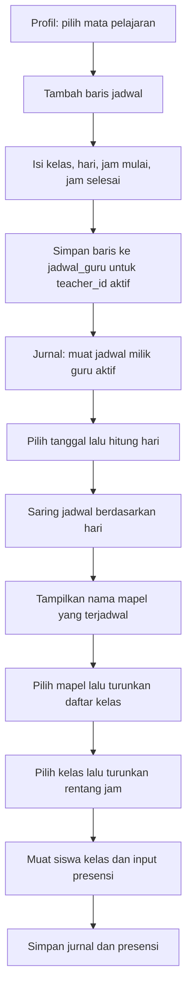

# Logika Seleksi Mata Pelajaran pada Input Jurnal

Dokumen ini menjelaskan bagaimana jadwal yang dikelola dari **Profil Saya** membentuk pilihan tanggal, mata pelajaran, kelas, dan jam pada formulir jurnal. Cakupan implementasi:

- `app/portal/jurnal/page.tsx`
- `app/portal/jurnal/actions.ts`
- `app/portal/profil/components/profile-tab.tsx`
- `app/portal/profil/actions.ts`
- RPC `submit_jurnal_and_presensi` pada migrasi database aktif

## 1. Model Data yang Terlibat

Satu baris `jadwal_guru` menyatakan jadwal seorang guru untuk kombinasi:

| Kolom | Makna |
| --- | --- |
| `teacher_id` | Pemilik jadwal, diisi dari pengguna yang sedang login saat jadwal baru disimpan. |
| `mapel_id` | Referensi ke mata pelajaran. |
| `kelas_id` | Referensi ke kelas. |
| `hari` | Hari jadwal, dari Senin sampai Sabtu. |
| `jam_mulai` | Nomor jam pelajaran awal. |
| `jam_selesai` | Batas akhir rentang jam pelajaran. |

Pada formulir jurnal, nilai mata pelajaran yang dipilih adalah **nama mapel**, kelas adalah **ID kelas**, dan nilai **Jam Ke** berupa string rentang, misalnya `1-2`. Jurnal menyimpan ketiganya bersama tanggal, materi, catatan, dan presensi.

## 2. Pengelolaan Mata Pelajaran dan Jadwal di Profil

Halaman profil memuat daftar mata pelajaran, kelas, dan jadwal milik pengguna. `jadwalList` diambil hanya untuk `teacher_id` pengguna yang sedang login. Komponen `ProfileTab` membentuk tampilan jadwal dengan `makeScheduleCards`:

1. Baris jadwal dikelompokkan berdasarkan `mapel_id` menjadi kartu mata pelajaran.
2. Setiap kartu memiliki satu atau lebih baris kelas/jadwal.
3. Baris memuat kelas, hari, `jam_mulai`, dan `jam_selesai`.
4. Nama yang ditampilkan berasal dari relasi mata pelajaran; kelas ditampilkan dari daftar kelas.

Untuk menambah jadwal:

1. **Tambah Kartu Mapel** menambahkan kartu baru dalam mode edit dengan `mapel_id` kosong.
2. Pilih mata pelajaran pada kartu.
3. Pilih **Tambah kelas mengajar** untuk menambahkan baris. Nilai awal baris adalah Senin, jam mulai 1, dan jam selesai 2.
4. Pilih hari, kelas, jam mulai, dan jam selesai. Pilihan jam pada antarmuka adalah bilangan 1 sampai 8.
5. Pilih **Selesai** pada baris untuk memanggil `saveJadwalGuru`.

Tombol ikon centang pada bagian judul kartu hanya mengubah mode edit kartu; penyimpanan baris jadwal dilakukan melalui tombol **Selesai** pada barisnya. Baris yang sudah tersimpan memiliki ID dan dapat diedit atau dihapus. Penghapusan kartu meminta konfirmasi bila kartu memiliki jadwal tersimpan, lalu menghapus baris-baris tersebut.

`saveJadwalGuru` melakukan hal berikut:

- Memastikan ada pengguna terautentikasi.
- Menolak `jam_mulai >= jam_selesai`.
- Untuk baris baru, menyisipkan `teacher_id` pengguna saat ini.
- Untuk pembaruan/penghapusan, mensyaratkan pemilik baris sesuai pengguna saat ini.
- Mengubah konflik constraint unik jadwal menjadi pesan bentrok.

Validasi rentang jam 1-8 berasal dari pilihan UI; Server Action secara eksplisit memvalidasi urutan mulai/selesai, bukan rentang maksimum jam.

## 3. Seleksi Tanggal dan Pilihan di Jurnal

### Memuat data sumber

Saat halaman jurnal dibuka, halaman memuat secara paralel:

- Daftar kelas (`getKelasList`).
- Rekap jurnal (`getRekapJurnal`).
- Jadwal guru yang sedang login beserta relasi `mata_pelajaran` dan `kelas` (`getJadwalGuruByTeacher`).

Pilihan kelas pada formulir input tidak langsung menggunakan seluruh `kelasList`. Daftar tersebut digunakan juga untuk menampilkan nama kelas pada rekap; pilihan formulir jurnal diturunkan dari jadwal hari yang dipilih.

### Tanggal → hari

- `selectedTanggal` awal diisi dari tanggal hari ini dalam WIT. Implementasi menggeser waktu saat ini sebesar UTC+9 sebelum mengambil bagian `YYYY-MM-DD`.
- `getHariWIT` membaca komponen tanggal dan menentukan nama hari dengan `Date.UTC`, sehingga tanggal input diperlakukan sebagai tanggal kalender, tidak sebagai waktu lokal browser.
- `selectedHari` menjadi dasar penyaringan jadwal.
- Saat tanggal diubah, handler mengosongkan mata pelajaran, kelas, dan jam yang dipilih sebelum pilihan turunan diperbarui.

### Hari → mata pelajaran

`jadwalHari` berisi baris jadwal dengan `jadwal.hari === selectedHari`.

`mapelOptions` mengambil `nama_mapel` dari relasi mata pelajaran pada `jadwalHari`, mengabaikan nama kosong, lalu menghilangkan duplikat menggunakan `Set`. Dengan demikian, daftar mapel menampilkan nama, bukan ID mapel.

Jika hanya ada satu nama mapel, effect memilihnya otomatis. Jika pilihan yang tersimpan tidak lagi ada dalam opsi hari terpilih, pilihan tersebut dikosongkan. Ketika tidak ada opsi, halaman menampilkan informasi bahwa tidak ada jadwal mapel pada hari itu.

### Mata pelajaran → kelas

`kelasOptions` hanya memasukkan baris `jadwalHari` yang nama mapelnya sama dengan `selectedMapel` dan memiliki relasi kelas. Kelas dikumpulkan dalam `Map` dengan ID kelas sebagai key, sehingga kelas yang muncul pada beberapa rentang jam hanya tampil sekali.

Jika hanya ada satu kelas, effect memilih kelas itu otomatis. Kelas yang tidak lagi cocok dengan mapel/hari aktif dikosongkan. Kontrol kelas dinonaktifkan sampai mapel dipilih.

### Kelas → jam

`jamKeOptions` mengambil baris dari `jadwalHari` yang memenuhi kedua kondisi:

1. Nama mapel sama dengan `selectedMapel`.
2. ID kelas pada relasi `kelas` atau foreign key `kelas_id` sama dengan `selectedKelasId`.

Setiap baris diubah menjadi string `${jam_mulai}-${jam_selesai}`, kemudian dideduplikasi dengan `Set` dan diurutkan secara numerik berdasarkan angka awal rentang. Contoh: `2-3` muncul sebelum `10-11` bila rentang angka tersebut tersedia.

Jika hanya ada satu rentang, effect memilihnya otomatis. Jika rentang terpilih tidak lagi tersedia, nilainya dikosongkan. Kontrol jam dinonaktifkan sampai kelas dipilih.

Perubahan mapel secara eksplisit mengosongkan kelas dan jam. Perubahan kelas tidak langsung mengosongkan jam pada handler, tetapi effect memeriksa ulang opsi jam untuk kombinasi kelas/mapel baru dan mengosongkan nilai bila sudah tidak valid.

## 4. Dampak Pemilihan Kelas pada Presensi

Saat `selectedKelasId` berubah, halaman mengambil siswa kelas itu melalui `getSiswaByKelas`. Setelah berhasil:

- Daftar siswa diisi untuk kelas terpilih.
- `presensiMap` dibentuk ulang dengan status awal `hadir` untuk setiap siswa.
- Jika belum ada kelas terpilih, daftar siswa dan map presensi dikosongkan.

Karena map presensi dibentuk ulang saat kelas berubah, perubahan kelas setelah mengisi status presensi akan memulai status kelas baru dari Hadir.

## 5. Penyimpanan Jurnal

Saat form dikirim, handler membangun payload presensi dari semua siswa yang saat itu dimuat, menggunakan status pada `presensiMap` atau `hadir` sebagai fallback. Handler menulis nilai state ke `FormData`:

- `kelas_id` ← `selectedKelasId`
- `tanggal` ← `selectedTanggal`
- `mata_pelajaran` ← `selectedMapel` (nama mapel)
- `jam_ke` ← `jamKeValue` (rentang, misalnya `1-2`)
- `presensi_json` ← daftar `{ siswa_id, status }`

`submitJurnalAndPresensi` memeriksa autentikasi dan memastikan kelas, mata pelajaran, jam, serta materi tidak kosong. JSON presensi harus dapat diparse. Selanjutnya Server Action memanggil RPC `submit_jurnal_and_presensi`.

RPC yang digunakan pada migrasi aktif memastikan `p_teacher_id` sama dengan `auth.uid()`, memastikan payload presensi berbentuk array, menyimpan jurnal, lalu memeriksa bahwa setiap siswa dalam payload memang berada pada kelas yang dikirim sebelum memasukkan presensi. Penulisan jurnal dan presensi berlangsung di dalam satu pemanggilan fungsi database.

## 6. Hubungan Profil dan Form Jurnal

Secara ringkas, Profil adalah sumber konfigurasi jadwal per guru, sedangkan halaman Jurnal membaca konfigurasi itu dan menjadikannya pilihan form. Kunci relasi yang dipakai adalah pengguna aktif (`teacher_id`), hari, mapel, kelas, dan rentang jam.

## 7. Batasan dan Perilaku yang Perlu Diketahui

- Jurnal menyimpan nama mapel (`mata_pelajaran` sebagai teks), sedangkan jadwal profil menyimpan `mapel_id`. Pencocokan pilihan dilakukan melalui `mata_pelajaran.nama_mapel`.
- Bila beberapa ID mapel mempunyai nama yang sama, `mapelOptions` menggabungkannya berdasarkan nama. Penyaringan kelas/jam juga memakai nama mapel, sehingga jadwal dengan nama sama dapat tergabung pada pilihan jurnal.
- Opsi di UI berasal dari jadwal yang sudah termuat. Jika jadwal baru dibuat atau diubah saat halaman jurnal yang sudah terbuka, halaman tersebut tidak memanggil ulang `getJadwalGuruByTeacher` secara otomatis; muat ulang halaman untuk mengambil ulang jadwal.
- RPC memeriksa bahwa siswa berada di kelas yang dikirim, tetapi kode RPC yang dirujuk tidak membandingkan tanggal/mapel/kelas/jam jurnal dengan baris `jadwal_guru`. Artinya, penyaringan jadwal adalah aturan pilihan UI, bukan validasi kecocokan jadwal eksplisit pada RPC tersebut.
- Jadwal harus lengkap agar pilihan tersedia: mapel, kelas, hari, dan rentang jam harus tersimpan pada baris jadwal milik guru yang login.

## 8. Ringkasan Dependensi State

| State/hasil | Diturunkan dari | Efek perubahan |
| --- | --- | --- |
| `selectedHari` | `selectedTanggal` | Mengubah jadwal hari yang tersedia. |
| `jadwalHari` | `jadwalGuru`, `selectedHari` | Menjadi sumber opsi mapel, kelas, dan jam. |
| `mapelOptions` | `jadwalHari` | Dapat memilih otomatis bila tinggal satu opsi. |
| `kelasOptions` | `jadwalHari`, `selectedMapel` | Kelas terpilih yang tidak valid direset; satu opsi dapat dipilih otomatis. |
| `jamKeOptions` | `jadwalHari`, `selectedMapel`, `selectedKelasId` | Jam terpilih yang tidak valid direset; satu opsi dapat dipilih otomatis. |
| `siswaList`, `presensiMap` | `selectedKelasId` | Memuat siswa kelas dan menginisialisasi status Hadir. |